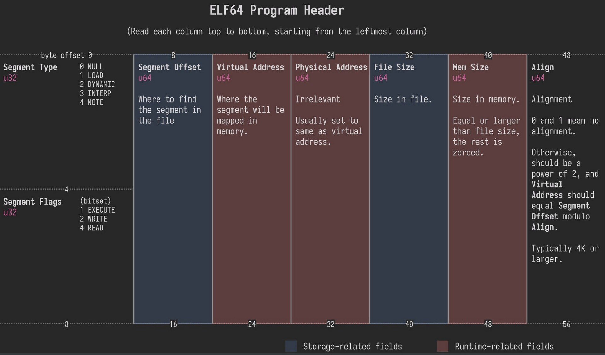
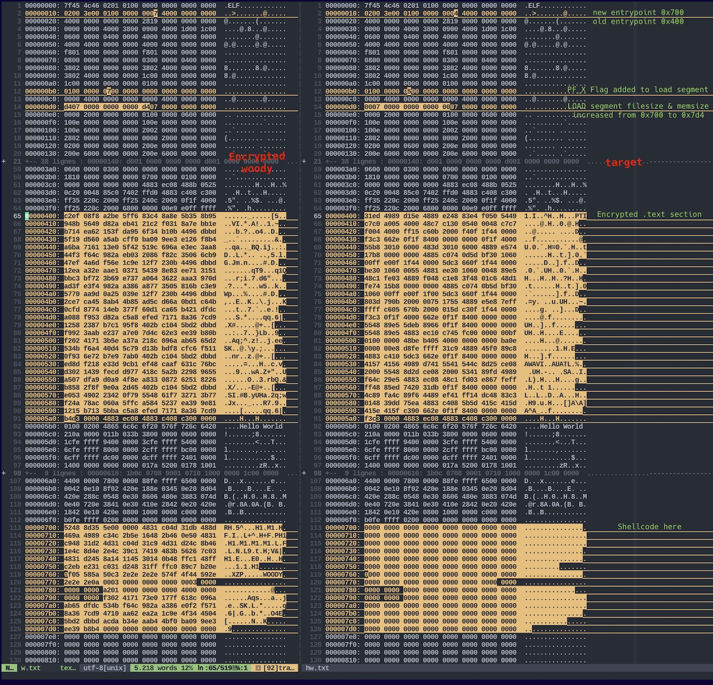

## How to make a packer ?

A packer is a utility which wrap a binary file. It can compress it and/or encrypt it such a way that this binary, when launched, uncompress/decrypt by itself then run. This can be used to pass throught antivirus analysis or alleviate the target.
This project only focus on encrypting.
Conceptually, the packer should :

1. Encrypt text section only (other parts can be sensitive for the pgm loading, like interpreter, headers or libraries)
2. Inject a shellcode which will be able to decrypt this text section at runtime and give control back to the program
3. Change entrypoint from program to the shellcode

The project asks that our utility encrypt the target under the name of _woody_. The packed binary will have to, when launched, print `....WOODY....` on stdout to indicate it decrypted itself then execute. Obviously its original behaviour must not be modified.

## ELF program header

An executable or shared object file's program header table is an array of structures, each describing a segment or other information the system needs to prepare the
program for execution. An object file segment contains one or more sections. Program headers are meaningful only for executable and shared object files. A file
specifies its own program header size with the ELF header's e_phentsize and e_phnum members. The ELF program header is described by the type Elf32_Phdr or Elf64_Phdr
depending on the architecture:

```c
typedef struct
{
  Elf64_Word    p_type;                 /* Segment type */
  Elf64_Word    p_flags;                /* Segment flags */
  Elf64_Off     p_offset;               /* Segment file offset */
  Elf64_Addr    p_vaddr;                /* Segment virtual address */
  Elf64_Addr    p_paddr;                /* Segment physical address */
  Elf64_Xword   p_filesz;               /* Segment size in file */
  Elf64_Xword   p_memsz;                /* Segment size in memory */
  Elf64_Xword   p_align;                /* Segment alignment */
} Elf64_Phdr;
```


_There is an important dichotomy to understand between storage related fields and runtime related fields. In our program, we will refer to the first to overwrite data while the target is maped to memory whereas our shellcode which executes in runtime (uncrypt a specific area) will refer to the second_

## How to write a shellcode

Shellcode found its name at the beggining of exploits. In the first time the main goal of injection was to open a shell. It's not the case anymore as it can be used to `chmod 777` or open another program, a connection with a client... There is many usages. So, it could be **named payload** or **injection code**.

Its better to write it first in assembly because there is more control over registers and final machine code. We also have control over which section we use, and we don't want any strings to be in `.rodata` or `.data` but everything in `.text` because the shellcode will be located in the address space of the target so we can't play to jump to an address to find a string, as it will be an address in the target, which will point to nothing or garbage.\
Shellcode must not include any header because of it will run into a target environnment which we are not sure it loaded the headers/libraries we would want. So a shellcode can only use `syscall`. Moreover, the smaller the shellcode, the better, so if we don't need 64bit registers it's ok to use 32 bits ones (ex: `eax` instead of `rax`), because 64bit registers are often represented with 2 bytes instead of 1 for the 32 bits.\
Finally, in a standalone asm code like the following it's important to `exit()` otherwise it segfault, because we don't have the C runtime environment to initialize the arguments on stack before going to main then exiting after the return of main. We want to test it as a standalone before injecting it.

```asm
bits 64
default rel
global _start

;     rdi   rsi    rdx
;      v     v      v
;write(fd,   msg,   len);

_start:
        xor     eax, eax
        cdq
        mov     dl, 10         ;3eme argument (rdx)
        inc     eax            ;eax = 1 (syscall)
        mov     edi, eax       ;1er argument rdi = 1
        lea     rsi, [rel msg] ;2eme arg
        syscall
        mov     dl, 42         ;petit registre pour enregistrer 42 sans 0x00
        xor     eax, eax
        inc     eax
        mul     dl             ;multiplier 42 * rax (rax = 1), resultat dans rax
        mov     edi, eax       ;bouger la valeur 42 de rax à rdi
        xor     eax, eax
        mov     al, 60         ;on met le syscall exit dans rax
        syscall

msg     db "..WOODY..",10
```

_This code writes '..WOODY..' on stdout and exit(42). All this tinkering for exit(42) is to avoid any NULLBYTE_

Compile this with `nasm -f elf64 -o print.o print.s && ld -o print print.o` and run `./print` to test the assembly code in a first place.
If it works, you can objdump it with `objdump -M intel -d print` to verify if there is not to much `0x00` in the machine code. NULL bytes can make the shellcode stops
into the target.

To finally get the shellcode and test it into a `.c` target, you can compile it flat with `nasm -f bin -o payload print.s`
then display machine code with xxd: `xxd -i -c 8 < payload | less` :

```sh
  0x31, 0xc0, 0x99, 0xb2, 0x0a, 0xff, 0xc0, 0x89,
  0xc7, 0x48, 0x8d, 0x35, 0x12, 0x00, 0x00, 0x00,
  0x0f, 0x05, 0xb2, 0x2a, 0x31, 0xc0, 0xff, 0xc0,
  0xf6, 0xe2, 0x89, 0xc7, 0x31, 0xc0, 0xb0, 0x3c,
  0x0f, 0x05, 0x2e, 0x2e, 0x57, 0x4f, 0x4f, 0x44,
  0x59, 0x2e, 0x2e, 0x0a
(END)
```

This can be pasted in target source and easily formatted to shellcode string with vim
or even better/easier, use `hexdump`with correct formatting : `hexdump -v -e '"\\\x\" 1/1 "%02x"' payload`

```c
char code[] =
    "\x31\xc0\x99\xb2\x0a\xff\xc0\x89\xc7\x48\x8d\x35\x12\x00\x00\x00\x0f\x05"
    "\xb2\x2a\x31\xc0\xff\xc0\xf6\xe2\x89\xc7\x31\xc0\xb0\x3c\x0f\x05\x2e\x2e"
    "\x57\x4f\x4f\x44\x59\x2e\x2e\x0a";
```

## How to test your shellcode

```c
/*
run.c - a small skeleton program to run shellcode
*/
// bytecode here
char code[] = "your shellcode";

int main(int argc, char **argv) {
  int (*func)();             // function pointer
  func = (int (*)()) code;   // func points to our shellcode
  (int)(*func)();            // execute a function code[]
  return 1;
}
```

Must be compiled with `-z execstack` so the stack is executable and the shellcode can be tested.
If the shellcode works into this testing target then it's ok to use it into the main program, else it has to be reviewed.

*https://www.exploit-db.com/docs/english/21013-shellcoding-in-linux.pdf*

## Injections techniques

There is many injections techniques but I will present three of them.

### Segment padding

It takes advantage of 0 padding after an executable load segment. It contains `.interp .init .text .fini .rodata` and few more AX sections. The following loadable
segment contains `.data .bss` and few other A sections. We can find 0 padding between these two segments into file because they (always?) follow themselves in file and memory. When loaded in memory, there is much more space as memory much be paged and aligned.
This technique has the advantage to be a lilttle bit stealth as it doesn't modify the elf structure. However injection success depends on the size of the codecave & most of the time the codecave is small and can't host a big shellcode. For this project my shellcode is 225B large so it almost always succeed.

### Elf shifting

It's about creating your codecave. This project uses this technique if the first does'nt succeed. I basically shift all offsets of segment and sections in file which are located at the end of the executable `LOAD` segment. Then I insert a big 0 padded codecave.
This technique modifies greatly the elf structure and the filesize so it's not stealth at all. But you can inject a shellcode as big as you want.

### PT_NOTE segment - .note.\* section

This project doesn't use this technique but it's about taking advantage of the `.note.ABI-tag` section header and `PT_NOTE` segment header. This section is never used and not critical for the binary mechanism. The idea is to create a codecave at the very end of the binary, then to modify the section and segment header so that they refer to a loadable and executable segment located where the injection will be (end of the file).

## Pseudo-code

I'm using the segment padding injection (taking advantage of 0 padding after an executable load segment) + shifting if no codecave had been found.

Map the target in memory (`mmap()`) and sanitize it (looking for ELF).\
Fetch & sanitize the executable LOAD segment.\
Measure size of cave and compare it to the shellcode size.\
Stop if codecave isn't large enough else continue.\
Fetch & sanitize the text section.\
Patch the shellcode with properties found in the load segment and text section.\
Move target program entrypoint to shellcode entrypoint.\
Writes this memory to a new file named **woody**.

Shellcode properties:\
Uncrypt crypted range.\
Writes `....WOODY....` on stdout.\
Return to the program entrypoint.\
_All needed data is patched to this code_

## Examples

```
[woody_woodpacker] file test/bin/hello_world
test/bin/hello_world: ELF 64-bit LSB executable, x86-64, version 1 (SYSV), dynamically linked, interpreter /lib64/ld-linux-x86-64.so.2, for GNU/Linux 3.2.0, not stripped
[woody_woodpacker] ./woody_woodpacker test/bin/hello_world
cave: 1808 - size of payload: 225 - size of patch: 104
KEY=
\x94\xf7\x9f\x4a\x4f\x8d\xfa\x4b
\xa0\x2e\xb3\x56\xc0\xed\x79\x90
\x1b\x39\x6d\xe1\xd\xf9\x76\x97
\x43\x9a\xe4\x8f\x20\x2e\x2f\x2e
\xba\xb8\x64\x6b\xee\x1f\x20\xcf
\x27\x4\xb3\xdd\x7\xe\xa6\x6a
\x91\x56\x66\xaf\xf2\x54\x8d\xe4
\x7a\x22\x66\xee\xe8\x28\x23\xa6
[woody_woodpacker] ./woody
....WOODY....
Hello World !
[woody_woodpacker] file /bin/date
/bin/date: ELF 64-bit LSB shared object, x86-64, version 1 (SYSV), dynamically linked, interpreter /lib64/ld-linux-x86-64.so.2, for GNU/Linux 3.2.0, stripped
[woody_woodpacker] ./woody_woodpacker /bin/date
cave: 200 - size of payload: 225 - size of patch: 104
Creating codecave...
cave: 4296 - size of payload: 225 - size of patch: 104
KEY=
\xec\x2d\x54\x10\x60\x6e\x26\x49
\x18\x40\x52\xed\xb2\x1a\xc0\xf7
\xe0\xf1\x8e\x40\x9f\xfa\x5d\x9d
\x3b\x38\x7d\x39\x39\xae\x45\xb3
\x26\x70\xb0\xac\x92\x92\xfb\x8c
\x4f\x1c\x67\xa4\x7f\xc4\x38\xee
\xd0\x9\xf2\x75\xbc\x1a\x97\xdd
\xe0\xb9\xc9\x8a\x36\x94\x97\x84
[woody_woodpacker] ./woody
....WOODY....
lundi 15 août 2022, 00:38:21 (UTC+0200)
[woody_woodpacker] file /home/linuxbrew/.linuxbrew/Cellar/git/2.37.1/bin/git
/home/linuxbrew/.linuxbrew/Cellar/git/2.37.1/bin/git: ELF 64-bit LSB executable, x86-64, version 1 (SYSV), dynamically linked, interpreter /home/linuxbrew/.linuxbrew/lib/ld.so, for GNU/Linux 2.6.32, not stripped
[woody_woodpacker] ./woody_woodpacker /home/linuxbrew/.linuxbrew/Cellar/git/2.37.1/bin/git
cave: 2108 - size of payload: 225 - size of patch: 104
KEY=
\x91\xdd\x56\x7\x68\x53\xb0\xec
\xd\x22\xc5\xa6\xed\x5d\xc7\xa6
\x94\x5\x74\x9b\x4b\xed\x5d\x59
\xd1\x12\x3d\xf0\xf5\x97\x39\x81
\x3c\x3c\x21\xef\x79\xef\x2e\x5f
\x84\xdd\x11\x17\x9c\x4d\x94\x2
\x12\x72\x38\xab\x66\xab\x3c\x3a
\x82\x26\xcf\x3a\x3b\x0\x43\xf
[woody_woodpacker] ./woody status
....WOODY....
Sur la branche main
Votre branche est en avance sur 'origin/main' de 1 commit.
  (utilisez "git push" pour publier vos commits locaux)

rien à valider, la copie de travail est propre
```

_I run here both ET_EXEC & ET_DYN (pie) targets and a target with a too small codecave_


_This is a vimdiff of a basic hello_world C pgm with its associated woody at the left. We can see where modifications are and the encrypted .text section_

## Miscellaneous

_Anatomy of a binary:_ \
https://hexterisk.github.io/blog/posts/2020/02/28/anatomy-of-a-binary/ \
https://wiki.osdev.org/ELF \
_Shellcode injection:_ \
https://dhavalkapil.com/blogs/Shellcode-Injection/ \
_How programs get run:_ \
https://lwn.net/Articles/631631/ \
_The Curious Case of Position Independent Executables:_ \
https://eklitzke.org/position-independent-executables \
_asm / nasm:_ \
https://cs.lmu.edu/~ray/notes/nasmtutorial/ \
https://www.cs.uaf.edu/2017/fall/cs301/reference/x86_64.html \
https://elixir.bootlin.com/linux/v4.13/source/arch/x86/entry/syscalls/syscall_64.tbl \
_Intel Syntax Reference Guide_ \
https://www.fuzzysecurity.com/tutorials/12.html
